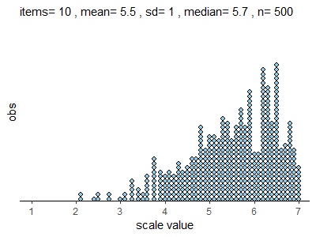

# WinzarH.github.io
Easy access to some of my work for colleagues 

# Purpose

Recent conference papers and journal articles reference some innovative techniques, data analyses, and data visualisations. 
I created this repository to share the code for these projects.

# Contents

## [LikertMaker](LikertMaker_24Oct2022.R)

<!---

--->

A novel method to reproduce Likert-scale data using only mean and standard deviation so that they can be properly visualised and interpreted

 

### Application

Most simulations of Likert-scale data are created to test analysis methods before finalising a questionnaire. Here, however, we want to reproduce published results where only the first two moments (mean and variance) are reported. Many publications report only means and standard deviations of rating scales, often only the means. The boundaries of a scale (1-5, 1-7, etc.) will often produce skewed data, so such simple statistics can be misleading. We demonstrate the application of Differential Evolution Optimisation to synthesise Likert-scale data using only the first two moments (mean and standard deviation). The algorithm is surprisingly accurate at reproducing published data. 

_LikertMaker_ is a __Shiny__ app embedded inside a single __Quarto__ document for easy download and use.

### Requirements
You will need to have installed: 
  1. the R statistical programming language 
  1. a recent version of RStudio GUI program
  1. the following packages __should__ be installed automatically if not already installed
      * __dplyr__      _(data manipulation)_
      * __ggplot2__    _(data visualisation)_
      * __shinybusy__  _(calculation/ progress indicator)_
      * __DEoptim__    _(non-linear optimisation)_
 
 _____
 
## [Correlator](likert_correlate.R)

A program that rearranges data points in a vector so that two vectors have a predefined correlation.

### Application

After creating two Likert-scale data sets using _LikertMaker_ this program rearranges the values so that the two scales are correlated at a level defined by the user.
I envision the program can be used to synthesise data that are only reported with means, standard deviations and correlations. This permits visualisation of the data

_Correlator_ is offered as an R file. I intend to create an interactive __Shiny__ app in the future. Maybe.

_____
